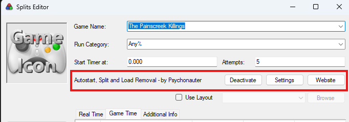

# LiveSplit.Painscreek

> [!WARNING]
> Time with load removal is not the official timing method

A [LiveSplit](https://github.com/LiveSplit/LiveSplit) auto splitter and load removal component for 'The Painscreek Killings'.

## Features

### Timer start

Automatically starts the timer when starting a new game.

### Load removal

Removes load times from the game time timer.

### Ending Split

Automatically performs a split at the end of the run.

## Configuration

With LiveSplit open, right-click on it to open the context menu and select "Edit Splits...". You can activate/deactivate and configure the component from there:

